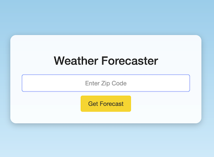
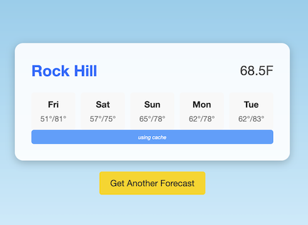

[](https://github.com/invalidusrname/weather_app/actions/workflows/ci.yml)

# Weather App

A small app that tells you the weather for a zip code




## Setup

Install dependencies

```
./bin/setup
```

## Running

Run the app locally in development mode

```
./bin/dev
```

If you do not have the master.key setup, you'll need to use an ENV var to fetch the weather:

```
WEATHER_API_TOKEN=88888CHANGEME8888888 ./bin/dev
```

## Tests

Run the specs

```
bundle exec rspec
```
